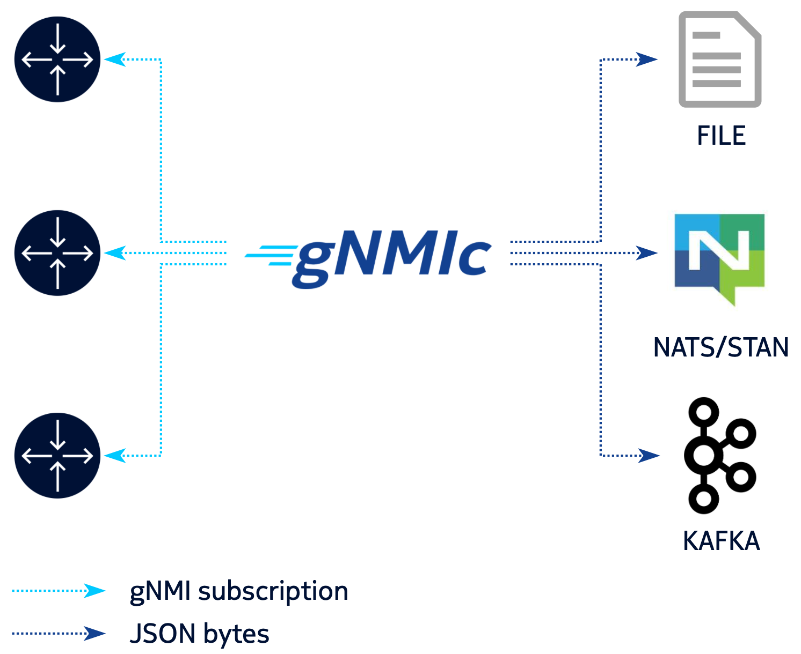

In the context of gnmi subscriptions (on top of terminal output) `gnmic` supports multiple output options:

* [Local file](file_output.md)
* [NATS messaging system](nats_output.md)
* [NATS Streaming messaging bus (STAN)](stan_output.md)
* [Kafka messaging bus](kafka_output.md)



These outputs can be mixed and matched at will with the different gnmi subscribe targets.

With multiple outputs defined in the [configuration file](../file_cfg.md) you can collect once 
and export the subscriptions updates to multiple locations formatted differently.

### Defining outputs

To define an output a user needs to create the `outputs` section in the configuration file:

```yaml
# part of ~/gnmic.yml config file
outputs:
  group1:
    - type: file # output type
      file-type: stdout # or stderr
      format: json
    - type: file
      filename: /path/to/localFile.log  
      format: protojson
  group2:
    - type: nats # output type
      address: 127.0.0.1:4222 # comma separated nats servers addresses
      subject-prefix: telemetry #
      format: event
    - type: file
      filename: /path/to/localFile.log  
      format: json
  group3:
    - type: stan # output type
      address: 127.0.0.1:4223 # comma separated nats streaming servers addresses
      subject: telemetry #
      cluster-name: test-cluster #
      format: proto
  group4:
    - type: kafka # output type
      address: localhost:9092 # comma separated kafka brokers addresses
      topic: telemetry # kafka topic
      format: proto
    - type: stan # output type
      address: 127.0.0.1:4223 # comma separated nats streaming servers addresses
      subject: telemetry
      cluster-name: test-cluster
```

Outputs can be defined in groups to be able to match a target with multiple outputs at once,

#### Output formats

Different formats are supported for all outputs

**Format/output** | **File**                           | **NATS / STAN**                   | **Kafka**
----------------- | ---------------------------------- | --------------------------------- | ---------:
**proto**         | <span style="color:red">:x:</span> | <span>:heavy_check_mark:</span>   | <span>:heavy_check_mark:</span>
**protojson**     | <span>:heavy_check_mark:</span>    | <span>:heavy_check_mark:</span>   | <span>:heavy_check_mark:</span>
**prototext**     | <span>:heavy_check_mark:</span>    | <span style="color:red">:x:</span>| <span style="color:red">:x: </span>
**json** (default)| <span>:heavy_check_mark:</span>    | <span>:heavy_check_mark:</span>   | <span>:heavy_check_mark:</span>
**event**         | <span>:heavy_check_mark:</span>    | <span>:heavy_check_mark:</span>   | <span>:heavy_check_mark:</span>

#### Formats examples

=== "protojson"
    ```json
    {
      "update": {
      "timestamp": "1595491618677407414",
      "prefix": {
        "elem": [
          {
            "name": "configure"
          },
          {
            "name": "system"
          }
        ]
      },
      "update": [
        {
          "path": {
            "elem": [
              {
                "name": "name"
              }
            ]
            },
            "val": {
              "stringVal": "sr123"
            }
          }
        ]
      }
    }
    ```
=== "prototext"
    ```yaml
    update: {
      timestamp: 1595491704850352047
      prefix: {
        elem: {
          name: "configure"
        }
        elem: {
          name: "system"
        }
      }
      update: {
        path: {
          elem: {
            name: "name"
          }
        }
        val: {
          string_val: "sr123"
        }
      }
    }
    ```
=== "json"
    ```json
    {
      "source": "172.17.0.100:57400",
      "subscription-name": "sub1",
      "timestamp": 1595491557144228652,
      "time": "2020-07-23T16:05:57.144228652+08:00",
      "prefix": "configure/system",
      "updates": [
        {
          "Path": "name",
          "values": {
            "name": "sr123"
          }
        }
      ]
    }
    ```
=== "event"
    ```json
    [
      {
        "name": "sub1",
        "timestamp": 1595491586073072000,
        "tags": {
          "source": "172.17.0.100:57400",
          "subscription-name": "sub1"
      },
        "values": {
          "/configure/system/name": "sr123"
        }
      }
    ]
    ```

### Binding outputs

Once the outputs are defined, they can be flexibly associated with the targets.

```yaml
# part of ~/gnmic.yml config file
targets:
  router1.lab.com:
    username: admin
    password: secret
    outputs:
      - group1
      - group3
  router2.lab.com:
    username: gnmi
    password: telemetry
    outputs:
      - group2
      - group3
      - group4
```
