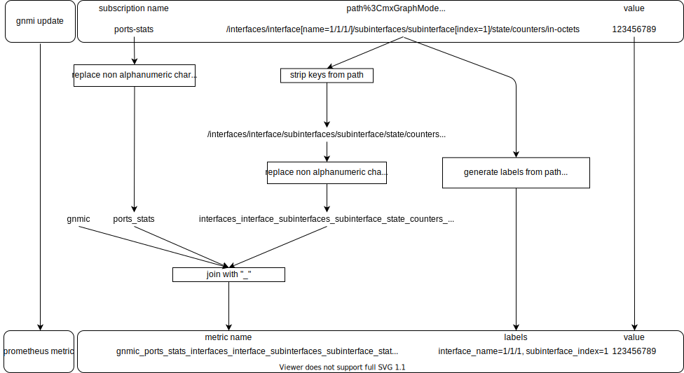

`gnmic` supports exposing gnmi updates on a prometheus server, for a prometheus client to scrape.

A Prometheus output can be defined using the below format in `gnmic` config file under `outputs` section:

```yaml
outputs:
  output1:
    type: prometheus # required
    listen: :9804 # address to listen on for incoming scape requests
    path: /metrics # path to query to get the metrics
    expiration: 60s # maximum lifetime of metrics in the local cache
    debug: false # enable debug for prometheus output
```

`gnmic` creates the prometheus metric name and its labels from the subscription name, the gnmic path and the value name.

## Metric Generation

The below diagram shows an example of a prometheus metric generation from a gnmi update



### Metric Naming

The metric name starts with the string __gnmic__ then the __subscription name__ as specified in `gnmic` configuraiton file, followed by the gNMI __path__ stripped from its keys if there are any. 

All non-alphanumeric characters are replaced with an underscore "`_`"

The 3 strings are then joined with an underscore "`_`"


For example, a gNMI update from subscription `port-stats` with path:

```bash
/interfaces/interface[name=1/1/1]/subinterfaces/subinterface[index=0]/state/counters/in-octets
```

is exposed as a metric named: 
```bash
gnmic_port_stats_interfaces_interface_subinterfaces_subinterface_state_counters_in_octets
```

### Metric Labels
The metrics labels are generated from the subscripion metadata (e.g: `subscription-name` and `source`) and the keys present in the gNMI path elements.

For the previous example the labels would be: 

```bash
{interface_name="1/1/1",subinterface_index=0,source="$routerIP:Port",subscription_name="port-stats"}
```
